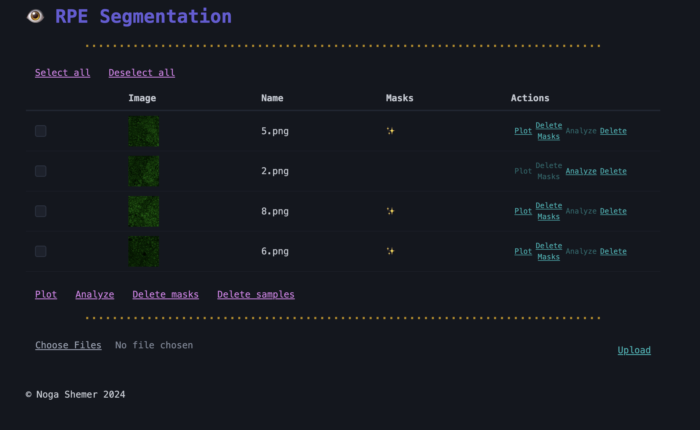

# RPE Segmentation

### Requirments
1. internet connection for the setup only
1. python 3.10 or 3.11 (no more no less, due to pytorch python version support) 
1. running the setup script (see section below)

### Running the program
_if its the first time, see Setup below_
1. open a terminal/powershell in the root folder "rpe_segmentation" or "rpe_segmentation-main" (open the folder -> in the white space, shift + right click -> Open in Terminal)
2. run the following command and leave the terminal open as long as its running
````
python -m src.main
````
or 
````
python3 -m src.main
````
3. navigate to [http://localhost:5001](http://localhost:5001) in your browser, and should see something like the first picture below.
(* tested only on chrome, others probably will be fine too)

4. if you want to gracefully shut down the program, enter the terminal window and type ctrl+C before closing the terminal.

### Usage
1. scroll down, click Choose files, then click Upload
1. for each sample you need to generate masks before plotting or exporting its data. you can also do so in batch operations - just click ````Select All```` above, and then on the action below the table (pink actions will apply to all selected samples)
1. enjoy :)

#### Troubleshooting
1. if the window loads forever, you might exited the terminal without closing the process gracefully.
run:
unix ````for pid in $(lsof -ti :5001); do kill -9 $pid; done```` 
windows ````(Get-NetTCPConnection -LocalPort 5001 -State Listen).OwningProcess | ForEach-Object { Stop-Process -Id $_ -Force }````
and run the program again

### First Time Setup
1. open a terminal/powershell in the destination folder (open the filder -> in the white space, shift + right click -> Open in Terminal)

2. *windows only: if its your first time, youll probably need to set execution policy to be able to run scripts from the terminal. by running* ````Set-ExecutionPolicy -ExecutionPolicy RemoteSigned -Scope CurrentUser ````.

3. download the files to the destination folder.
preferebly using git clone, so you won't need to run the setup script again when getting updates (you might need to install [github cli](https://cli.github.com/), and authenticate as the user youve logged in to github to watch this repository).
````
gh repo clone nshem/rpe_segmentation
````

4. enter the root folder of the project ("rpe_segmentation or rpe_segmentation-main") and open the terminal from there (or ````cd rpe_segmentation```` or ````cd rpe_segmentation-main```` in the existing terminal)

5. execute the setup script by running the following command (it should take sometime, depends on your internet connection, 3-20 minutes)
````
./setup_windows.ps1 
````
or
````
./setup_unix.sh
````

6. as its last operation, the setup script will run the program. but after the first time you can just run it as described in _Running the program_ section above.

### Updates
1. when needed, enter the root folder (rpe_segmentation or rpe_segmentation-main)

1. open a teminal and run 
````git pull origin main````
(make sure you have [*git* cli](https://git-scm.com/book/en/v2/Appendix-A:-Git-in-Other-Environments-Git-in-PowerShell) installed, not the same as *github* cli above)

1. run the program again (no need for running the setup script) and it shoud work

1. troubleshooting after updates:
  - database errors: delete the db.db file and run the program again
  - python dependencies errors: run the setup script and run the program again

### Contributing
if you made code changes please push them to a branch and create a pull rquest
````
git checkout -b "<change_name>"
git add --all
git commit -m "<change_description>"
git push
````
enter the repository in github and create a pull request
* note that if you've made changes without merging them to main and then pull updates, it might create a mess

### Examples



